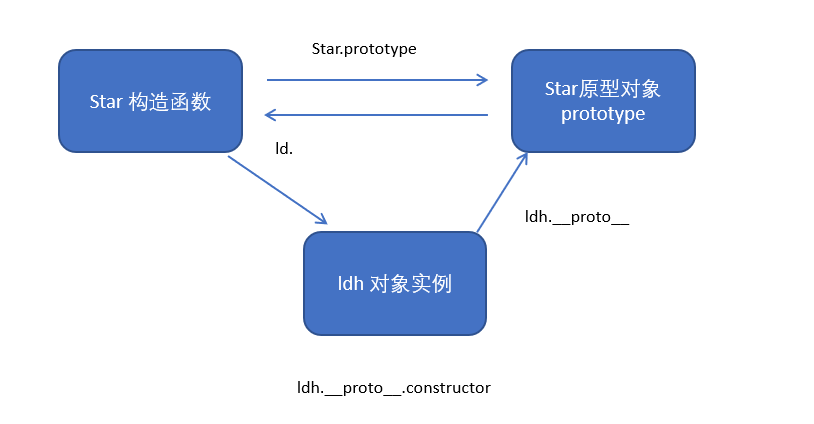
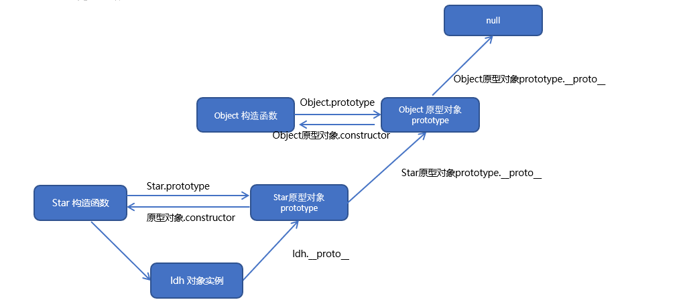

面向过程编程POP
面向对象编程OOP

对象是一个具体的事物
类抽象了对象的公共部分，它泛指某一大类

### constructor
通过class关键字创建类，类目我们习惯性定义首字母大写
constructor函数，可以接收传递过来的参数，同时返回实例对象
constructor函数只要new生成实例，就会自动调用这个函数，如果我们不写这个函数，类也会自动生成这个函数

### super
super关键字用于访问和调用对象父类上的函数。可以调用父类的构造函数，也可以调用父类的普通函数
super必须在子类this之前调用

在ES6中类没有变量提升，所以必须先定义类，才能通过类实例化对象
类里面的共有属性和方法一定要加this使用
constructor里面的this指向实例对象，方法里面的this指向这个方法的调用者

### insertAdjacentHTML
insertAdjacentHTML() 方法将指定的文本解析为 Element 元素，并将结果节点插入到DOM树中的指定位置。它不会重新解析它正在使用的元素，因此它不会破坏元素内的现有元素。这避免了额外的序列化步骤，使其比直接使用innerHTML操作更快。

### 双击禁止选定文字
双击的事件是：ondblclick
window.getSelection ? window.getSelection().removeAllRanges() : document.selection.empty();

### 创建对象可以通过以下三种方式
1.对象字面量
2.new Object()
3.自定义构造函数

### 构造函数创建对象
```javascript
 function Star(uname, age) {
            this.uname = uname;
            this.age = age;
            this.sing = function() {
                console.log('我会唱歌');

            }
        }

        var ldh = new Star('刘德华', 18);
        var zxy = new Star('张学友', 19);
        console.log(ldh);
        ldh.sing();
        zxy.sing();
```
构造函数是一种特殊的函数，主要用来初始化对象，即为对象成员变量赋初始值，它总与new一起使用。我们可以把对象中一些公共的属性和方法抽取出来，然后封装到这个函数里面。
在JS中，使用构造函数时要注意以下两点：
1.构造函数用于创建某一类对象，其首字母要大写
2.构造函数要<mark>和new一起使用</mark>才有意义

new在执行时会做四件事情：
① 在内存中创建一个新的空对象
② 让this指向这个新对象
③ 执行构造函数里面的代码，给这个新对象添加属性和方法
④ 返回这个新对象（所以构造函数里面不需要return）

### 实例成员和静态成员
实例成员就是构造函数内部通过this添加的成员，实例成员只能通过实例化的对象来访问 例如 console.log(ldh.uname)

静态成员 在构造函数内部本身上添加的成员，例如 console.log(Star.uname)

### 构造函数原型 prototype
构造函数通过原型分配的函数是所有对象共享的
我们也称prototype为原型对象
一般情况下，我们的公共属性定义到构造函数里面，公共的方法我们放到原型对象身上

### 对象属性__proto__
对象身上系统自己添加一个__proto__指向我们构造函数的原型对象 prototype
__proto__对象原型和原型对象prototype是等价的
方法的查找规则: 首先先看ldh 对象身上是否有 sing 方法,如果有就执行这个对象上的sing
如果么有sing 这个方法,因为有__proto__ 的存在,就去构造函数原型对象prototype身上去查找sing这个方法


### constructor构造函数
constructor我们称为构造函数，因为它指回构造函数本身
constructor主要用于记录该对象引用于哪个构造函数，它可以让原型对象重新指向原来的构造函数
很多情况下，我们需要手动的利用constructor这个属性指回原来的构造函数


### JavaScript的成员查找机制（规则）
1.当访问一个对象的属性（包括方法）时，首先查找这个对象自身有没有该属性
2.如果没有就查找它的原型（也就是__proto__指向的prototype原型对象）
3.如果还没有就查找原型对象的原型（Object的原型对象）
4.依此类推一直找到Object为止（null）
5.__proto__对象原型的意义就在于为对象成员查找机制提供一个方向，或者说一条路线

### 利用原型对象拓展内置对象
注意：数组和字符串内置对象不能给原型对象覆盖操作Array.prototype={}，只能是Array.prototype.xxx=function(){}的方式

### call()
调用这个函数，并且修改函数运行时的this指向
fun.call(thisArg,arg1,arg2,arg3,...)
thisArg：当前调用函数this的指向对象
arg1,arg2,arg3...：传递的其他参数

### 借用父构造函数继承属性
```  Father.call(this, uname, age);```

### 借用原型对象继承方法
``` Son.prototype = new Father();```

### 类的本质
类的本质其实还是一个函数，我们也可以简单的认为类就是构造函数的另一种写法
1.类有原型对象prototype
2.类原型对象prototype上有一个constructor属性，指向类本身
3.类可以通过原型对象添加方法
4.类创建的实例对象有__proto__原型 指向类的原型对象
ES6的类其实就是语法糖
语法糖就是一种便捷写法，简单理解，有两种方法可以实现同样的功能，但是一种写法更加清晰、方便，那么这个方法就是语法糖

### ES5中的新增方法
数组方法
迭代（遍历）方法：forEach()、every()、filter()、map()、some()
array.forEach(function(currentValue,index,array){
    //currentValue:数组当前的项
    //index:数组当前项的索引
    //arr:数组对象本身
})
array.filter(function(currentValue,index,arr){
    //currentValue:数组当前的项
    //index:数组当前项的索引
    //arr:数组对象本身
})
ps:直接返回一个新数组，主要用于筛选数组
示例：
``` javascript
   var arr = [12, 66, 4, 88, 3, 7];
        var newArr = arr.filter(function(value, index) {
            // return value >= 20;
            return value % 2 === 0;
        });
        console.log(newArr);
```
array.some(function(currentValue,index,arr){
    //currentValue:数组当前的项
    //index:数组当前项的索引
    //arr:数组对象本身
})
ps:直接返回一个布尔值，主要用于判断数组中是否有满足条件的项,如果找到第一个满足条件的元素，则终止循环，不在继续查找
